# 💼 DevFolio Landing Page

A multi-page portfolio-style landing page called *DevFolio*.  
The project was built using *HTML, CSS, Bootstrap, and some JavaScript*.  

---

## 🚀 Features 
- Responsive design powered by Bootstrap.  
- Smooth navigation and clean UI.  
- Interactive elements with JavaScript.

---

## 🛠 Technologies Used
- *HTML5*  
- *CSS3*  
- *Bootstrap* (for responsive layout and components)  
- *JavaScript* (for interactivity)  

---

## 📸 Screenshots

### Main Page
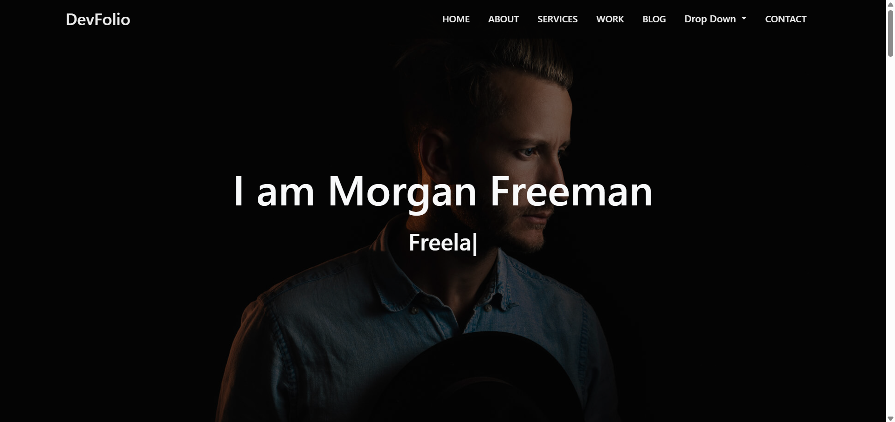
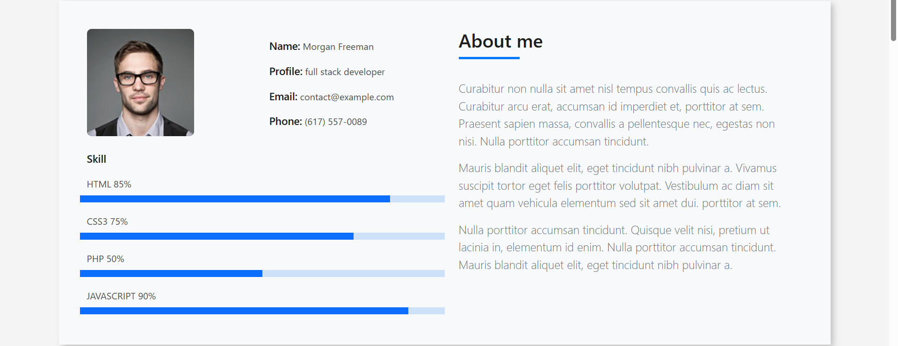
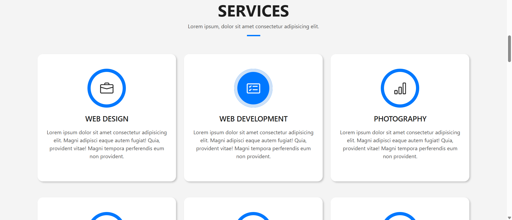
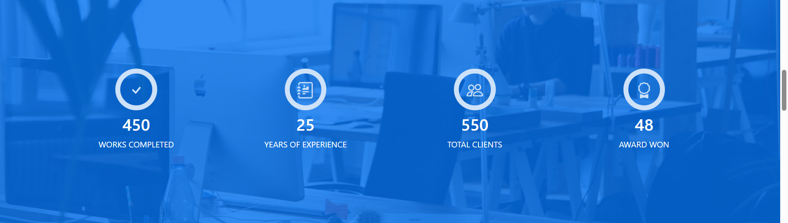
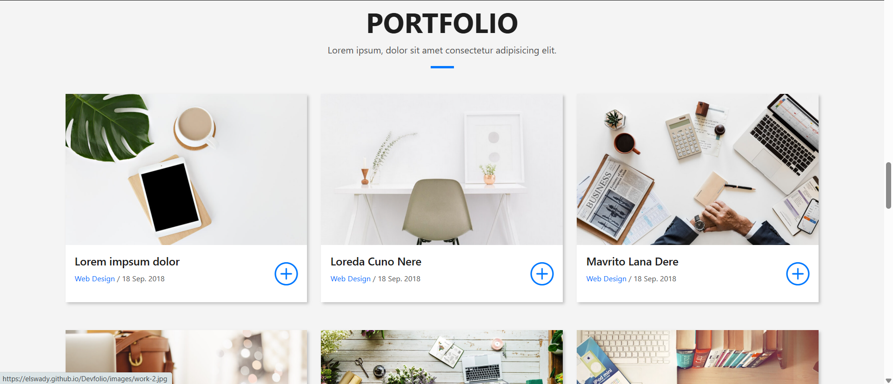
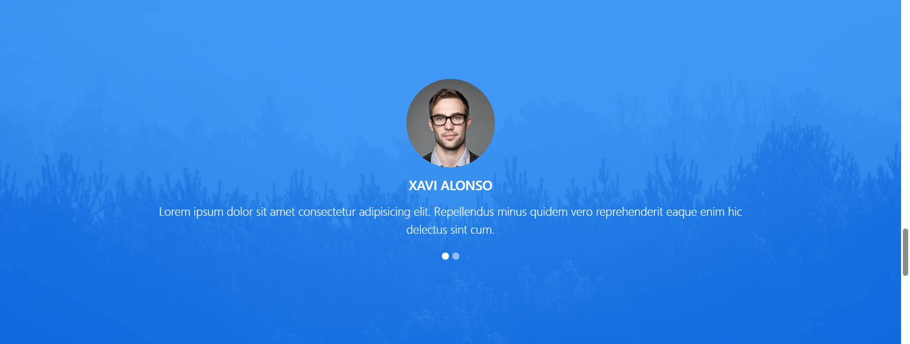
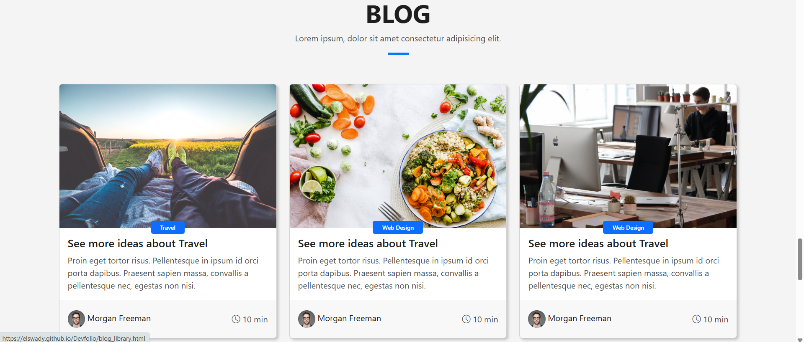
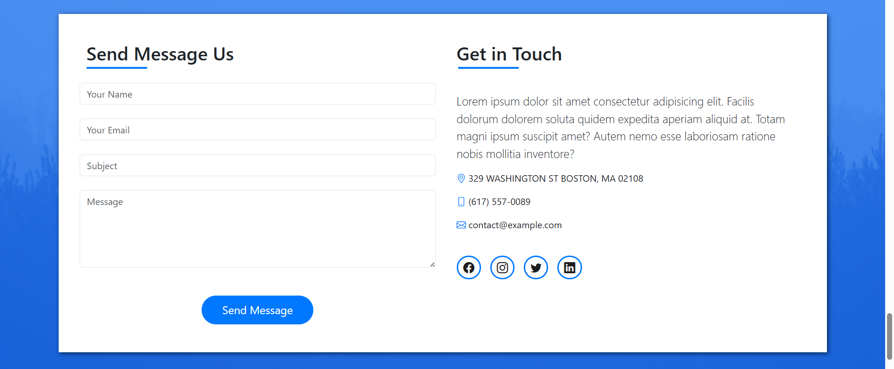

### Portfolio Details Page
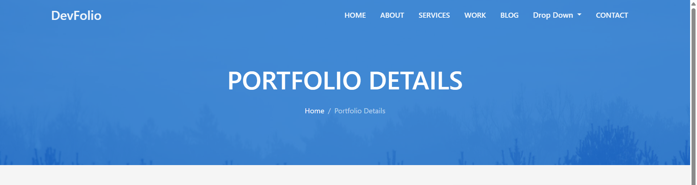

### Blog Details Page
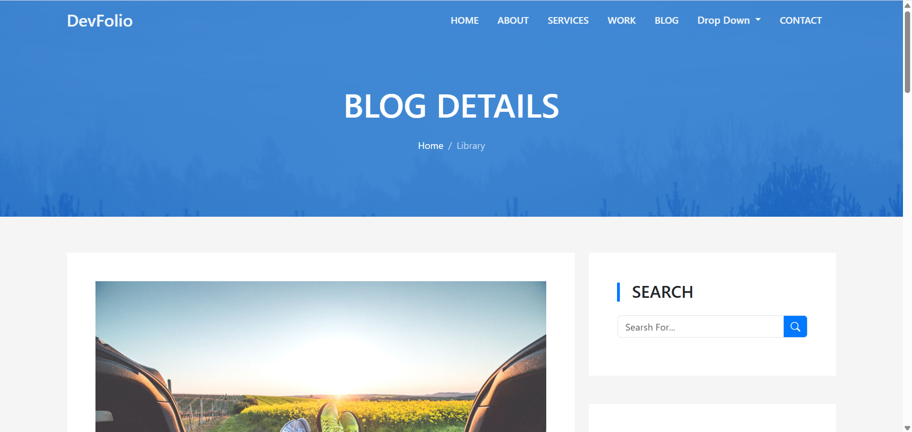
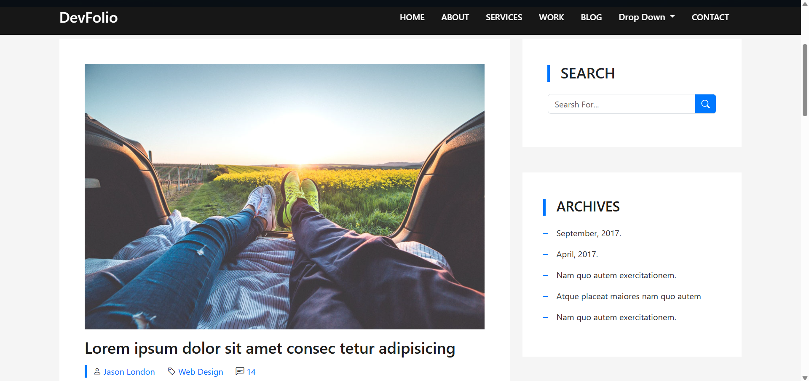
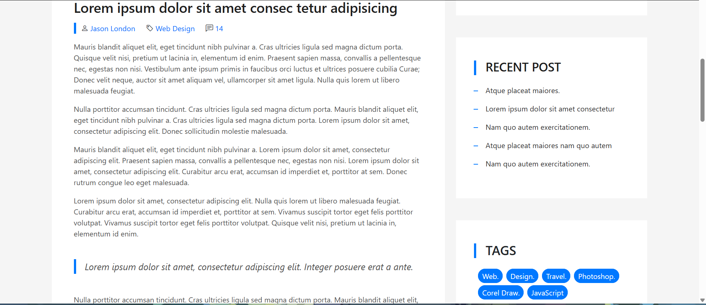
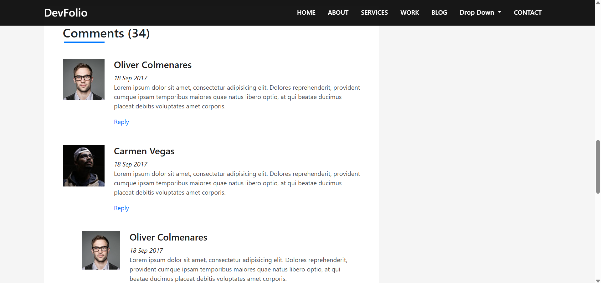
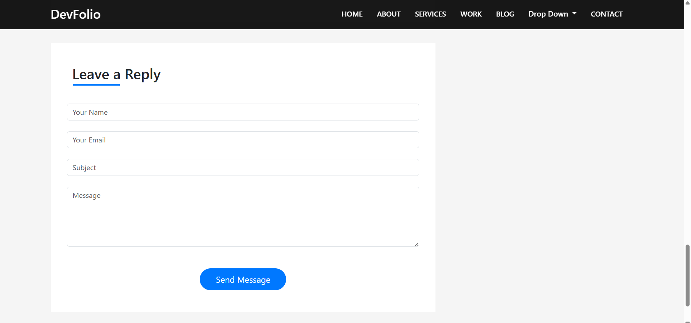
